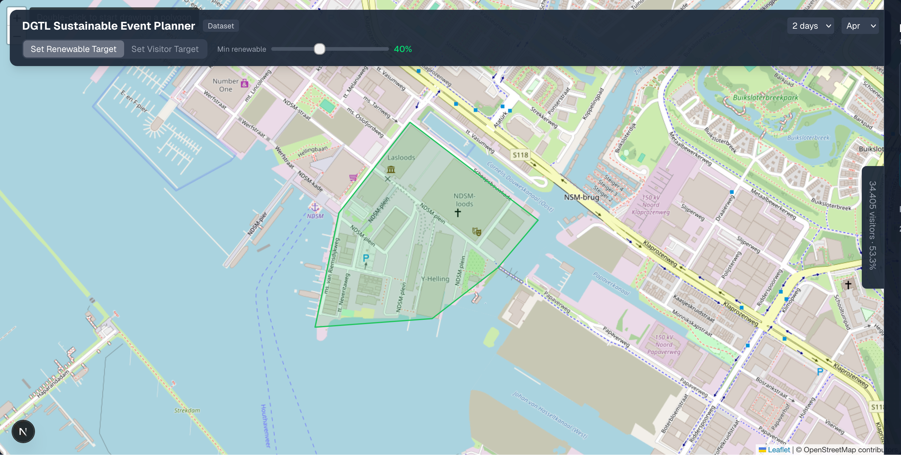
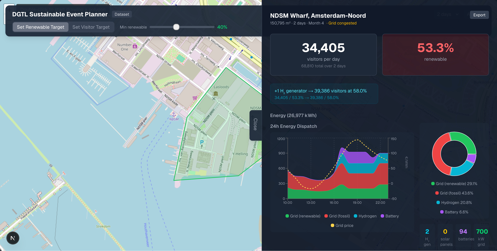
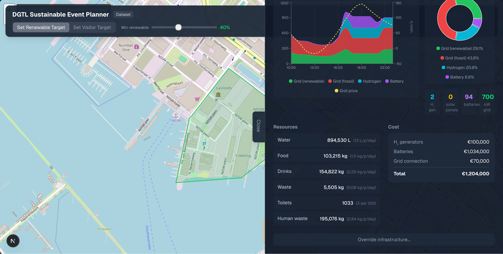

# DGTL Sustainable Event Planner

**What if the land decided how big your festival can be?**

Traditional event planning starts with a target visitor count and works backwards. This tool flips that model — it takes the physical space, local energy grid, and renewable sources available, then calculates the **maximum number of visitors your venue can sustainably support**.

Built for the [DGTL Festival](https://dgtl.nl/) hackathon, targeting real-world sustainable event planning at NDSM Wharf, Amsterdam.

## Highlights

- **Draw your venue** on an interactive map and get instant capacity calculations
- **Multi-source energy modeling** — grid, solar, hydrogen, and battery storage dispatched hour-by-hour
- **Smart nudges** — actionable suggestions to increase capacity or improve your renewable energy percentage
- **Full resource breakdown** — water, food, waste, toilets, and cost estimates per visitor
- **Real data** — PVGIS solar irradiance, EPEX spot prices, Liander grid capacity, DGTL measured material flows

## How It Works

### 1. Define Your Event Area

Draw a polygon on the map to outline your festival grounds. The tool calculates the area and identifies the location's grid capacity and solar potential.

<p align="center">
  
</p>

### 2. Explore Energy & Capacity

Set a renewable energy target or a visitor goal — the optimizer calculates the sustainable maximum. View a detailed 24-hour energy dispatch showing how grid (renewable & fossil), hydrogen generators, solar panels, and batteries combine to power your event.

<p align="center">
  
</p>

### 3. Review Resources & Costs

Get a full breakdown of water, food, drinks, waste, and sanitation needs — plus infrastructure cost estimates for hydrogen generators, batteries, solar panels, and grid connections.

<p align="center">
  
</p>

## Tech Stack

| Layer    | Technology                                      |
| -------- | ----------------------------------------------- |
| Frontend | Next.js 16, React 19, TypeScript, Tailwind CSS 4 |
| Maps     | Leaflet + react-leaflet                         |
| Charts   | Recharts                                        |
| Backend  | Python 3.12, FastAPI, Pydantic v2               |
| Infra    | Docker Compose                                  |

## Getting Started

### Prerequisites

- [Docker](https://docs.docker.com/get-docker/) and Docker Compose

### Run

```bash
docker compose up
```

The app will be available at [http://localhost:3000](http://localhost:3000).

### Local Development

**Backend:**

```bash
cd backend
uv sync
uv run uvicorn main:app --reload --port 8000
```

**Frontend:**

```bash
cd frontend
npm install
npm run dev
```

## Data Sources

| Source | Used For |
| ------ | -------- |
| [PVGIS](https://re.jrc.ec.europa.eu/pvg_tools/) | Monthly solar irradiance by location |
| [EPEX Spot](https://www.epexspot.com/) | Hourly Dutch electricity prices |
| [Liander Open Data](https://www.liander.nl/open-data) | Grid capacity and congestion data |
| [Waternet](https://www.waternet.nl/) | Water consumption benchmarks |
| DGTL Festival | Measured material flows (food, drinks, waste) |
| OpenStreetMap | Base map tiles and venue selection |

## Team

Built during the DGTL Hackathon 2026, Amsterdam.

## License

This project is provided as-is for hackathon demonstration purposes.
